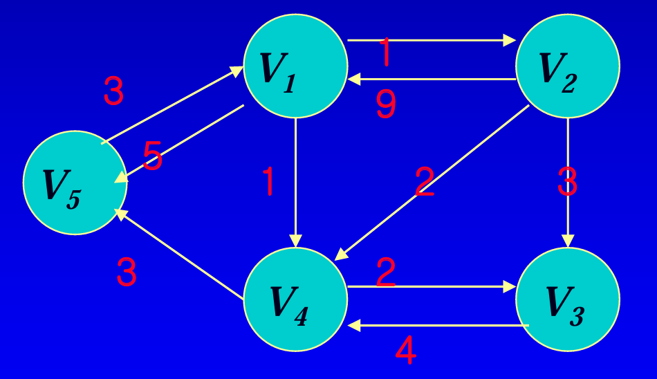

# floyd 알고리즘

## 문제
경로상에서 모든 vertex 에 대해 다른 vertex 로 가는 최단거리 구하기. \
강의자료의 dynamic programming 의 예시 문제이다.



위와 같은 그래프에서 각 vertex 간의 최단거리 구하기.

## 해설
dp 와 divide and conquer 를 착각할 수 있는데 차이점은 dp 는 문제의 해 로 가는데, 이전에 계산한 값이 누적되어 쓰인다는 것이다. \
반면 divide and conquer 는 하나의 큰 문제를 부분으로 쪼개서 접근하는 방식.

해당 문제는 다음과 같이 생각해 볼 수 있다.

`D^k[i][j]` 를 정의하길 k번째 까지 노드만 사용하여 i 에서 j 로의 최단거리를 의미한다. \
즉 k 가 5인 경우에는 `v1, v2, v3, v4, v5` 만을 이용하여 `vi ~ vj` 최단거리를 뜻함.

여기서 case 를 둘로 나눌 수 있다.

1. `vk` 가 최단거리에 이용된다.
    - `D^k[i][j]` = `D^k-1[i][k]` + `D^k-1[k][j]`
2. 이용되지 않는다.
    - `D^k[i][j]` = `D^k-1[i][j]`

자 그럼 이를 어떻게 계산할까?

```
for (int k = 0; k < n; k++) {
    for (int i = 0; i < n; i++) {
        for (int j = 0; j < n; j++) {
            dGraph[i][j] = Math.min(dGraph[i][j], dGraph[i][k] + dGraph[k][j]);
        }
    }
}
```

이 코드를 마주했을 때 드는 생각은 이게 정말 동작하는지였다. \
가장 고민이였던 케이스는 k 번째까지 누적된 최소경로가 과연 k + 1 "만" 포함하는 최소 경로로 업데이트 될 수 있는가 였다. \
결론적으로는 된다. 왜냐하면 dGraph 에 누적된 최소경로는 이전까지의 k를 포함하는 경로를 갖고있고, 이는 `dGraph[i][k] + dGraph[k][j]` 에 대체 될 수 있기 때문이다. 

직접 test 코드를 작성해서 디버깅을 돌려보니 이해가 잘된다.