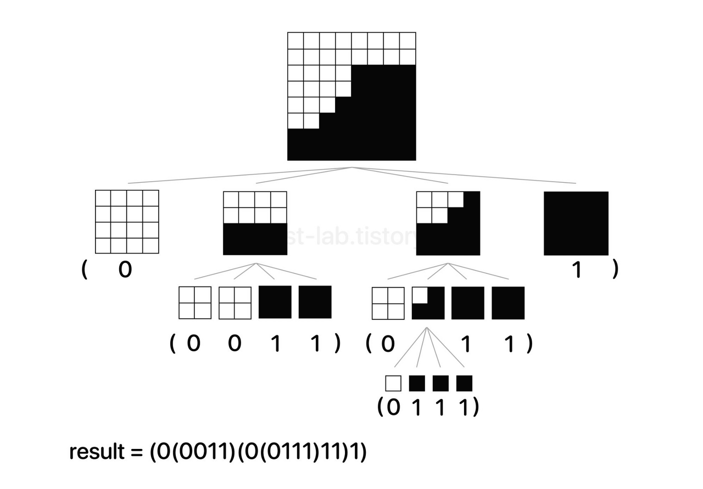

# 쿼드트리뒤집기 ReverseQuadTree

## 문제 설명

쿼드트리란 대량의 좌표 데이터를 저장하는 방법으로 주어진 공간을 4등분하여 재귀적으로 표현. \
이는 검은색, 흰색으로만 표현된 그림을 압축하는데 이용됨. 표현은 다음 방식으로

- 검은색: b
- 흰색: w
- 섞여있다면 해당 공간을 또 네등분, 같은 과정 반복.



문제는 주어진 쿼드트리를 상하로 뒤집었을때의 결과를 리턴하면 된다. \
example)
```
xbwwb -> xwbbw
xbwxwbbwb -> xxbwwbbbw
```

## 풀이 전략
쿼드트리는 4개의 부분으로 나눌 수 있으므로 재귀함수에서 각 파트로 나눈다, 그리고 b 나 w 로 끝맺음 되는 지점까지 내려가서 리턴되면 해당 값을 상 하 로 뒤집어서 리턴한다. \
이렇게 쌓아올려서 마지막에서도 순서만 바꿔서 리턴해주면 될 것으로 보인다.